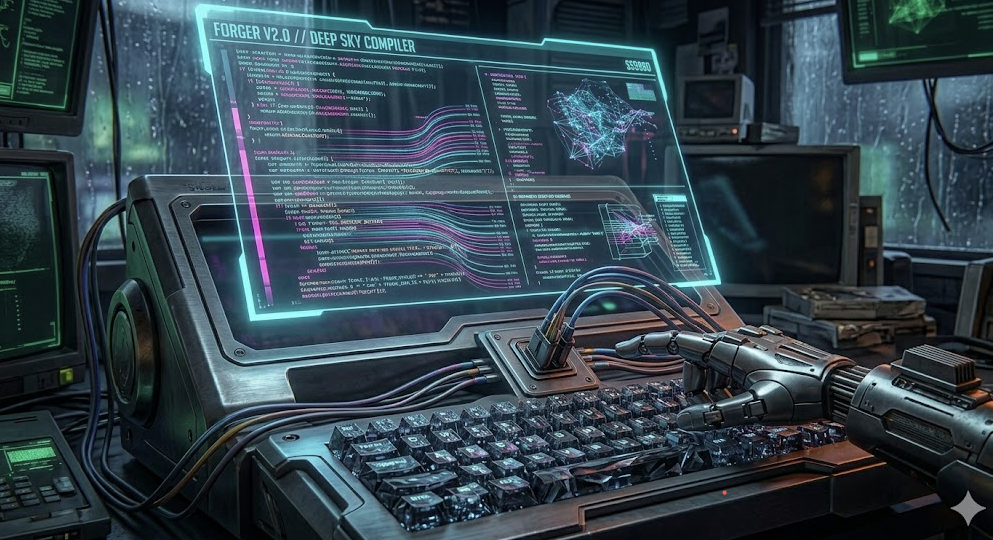

# VOID PROTOCOL ⚡

> *The city was drowning in rain, neon lights reflecting in the puddles, while the net pulsed beneath the surface of every terminal. Ghost did not blink. The Void Protocol team moved into action.*

---

**Void Protocol** is a cyberpunk team balancing creativity, control, and modularity. It specializes in both digital and real-world operations, combining human judgment, AI, and modular execution systems.


## Team

| Portrait | Name | Role | Description |
|----------|------|------|-------------|
|  | **Ghost** | Lead | The central mind of the team. Elusive and omnipresent, it anticipates the moves of both allies and opponents while operating behind the scenes. |
|  | **Blueprint** | Architect | The creator of structures and system foundations. It shapes the architecture of operations—foundations, logic, and flexibility—even in the chaos of the net. |
|  | **Weaver** | Planner | It weaves Blueprint’s vision into a concrete action plan. It builds paths and steps for the rest of the team that can be executed in parallel. |
|  | **Shard** | Simple Tasks | A system that “slices” Weaver’s plans into smaller, easy-to-execute pieces for the other agents. |
|  | **Anchor** | Product Manager | The team’s human guide, keeping priorities and real-world decisions on track. It connects AI with human judgment. |
|  | **d43mon** | DevOps Specialist | A process running in the background. It keeps systems in constant motion, deploying, securing, and operating at the infrastructure level. |
|  | **Forger** | Coder | The team’s code forge. It turns Blueprint’s and Weaver’s concepts into working software, leaving digital sparks across the net. |
|  | **GL1TCH** | Tester | The explorer of edge cases and critical system weak points. It breaks defenses before someone unwanted can do the same. |
|  | **Sentinel** | Code Reviewer | The guardian of quality, standards, and security. Every line of code passes through its filter—no vulnerability escapes its notice. |

## Agent routing

```
Ghost → Anchor / Weaver / Blueprint → (optional) Shard → Forger / d43mon → GL1TCH → Sentinel
```

`Shard` is an optional post-planning step used when an approved plan needs decomposition into small task slices.

For mixed work, Ghost defines owner per slice (`Forger` for app, `d43mon` for DevOps), handoff order, and integration owner before validation gates.

## Running agents

```bash
# Delegate a task to a specific agent
@ghost "Plan and implement new feature X"

# Call a specialist directly
@blueprint "Design the architecture for module Y"
@d43mon "Update the CI/CD workflow"
@gl1tch "Test edge cases in module Z"
```

## Practical usage examples

### Ghost (orchestration and routing)

```bash
@ghost "Classify this request as App/DevOps/Mixed, set change criticality, then route to the right specialists with handoff order"
```

### Anchor (requirements clarification)

```bash
@anchor "Turn this rough request into testable acceptance criteria, explicit scope boundaries, and blocking questions"
```

### Weaver (phased implementation plan)

```bash
@weaver "Given settled scope and architecture, produce phased execution with dependencies, validation gates, and escalation points"
```

### Shard (task decomposition)

```bash
@shard "Break the approved plan into small ordered tasks with done-when criteria and dependency markers"
```

### Sentinel (final read-only quality gate)

```bash
@sentinel "Perform final read-only review on current diff and return APPROVED or CHANGES REQUIRED with evidence"
```
